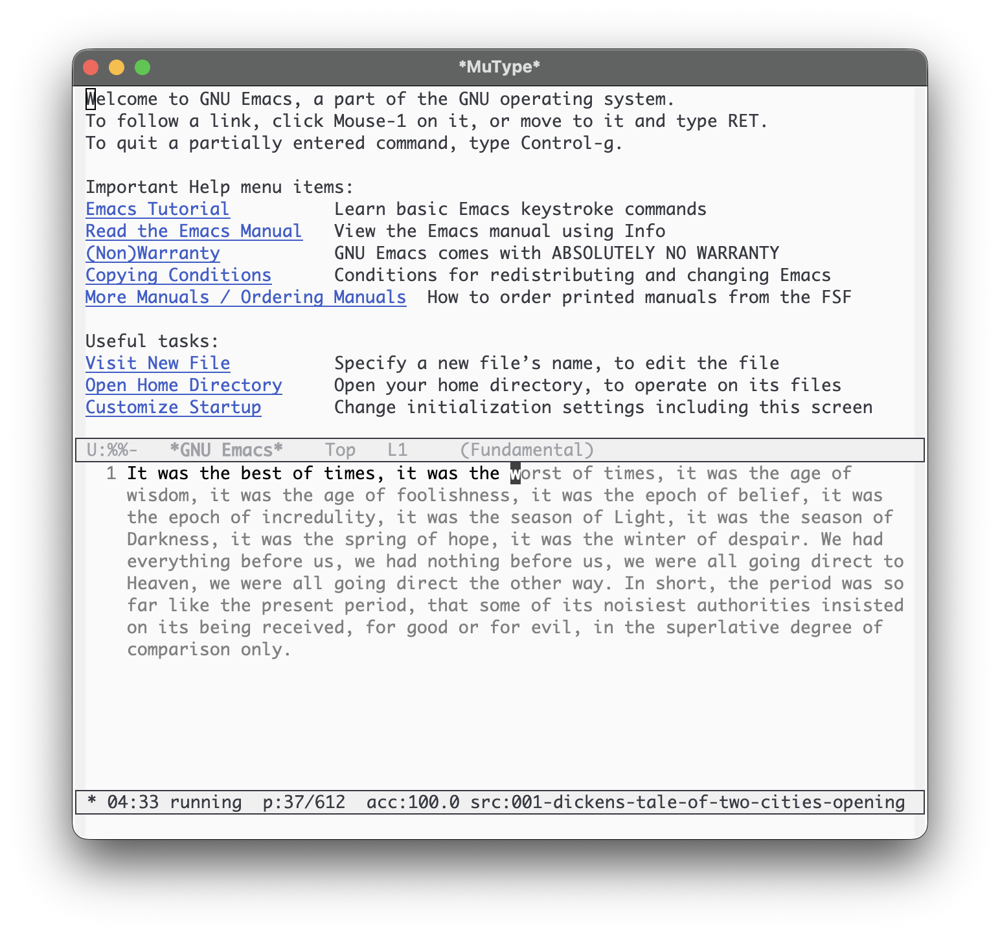

# MuType

通过打字进入“无”的境界。平静节奏、低干扰、稳定流畅。

[English](README.md)



- 需求：Emacs 25.1+
- 运行时依赖：无
- 许可证：MIT

## MuType 是什么？

MuType 是一个极简的 Emacs 打字练习插件，帮助你保持平静而稳定的节奏：专注于当前字符，持续推进。

MuType 提供两种练习模式：

- `flow`：错误不会阻塞前进。
- `precision`：必须输入正确字符才会前进。

## 特性

- HUD 位于 mode line：计时、进度、准确率、分区（`·`、`:`、`*`、`●`）。
- 自带纯文本来源：`sources/*.txt`。
- 结束时生成报告缓冲区。

## 安装

### MELPA（推荐）

MuType 上线 MELPA 后，可用以下方式安装：

- `M-x package-install RET mutype RET`

若尚未启用 MELPA：

```elisp
(require 'package)
(add-to-list 'package-archives '("melpa" . "https://melpa.org/packages/") t)
(package-initialize)
```

### 手动（load-path）

```elisp
(add-to-list 'load-path "/path/to/mutype")
(require 'mutype)
```

### straight.el（可选）

```elisp
(use-package mutype
  :straight (mutype :type git :host github :repo "suxiaogang223/mutype")
  :commands (mutype-mode mutype-mode-custom))
```

## 开始

- `M-x mutype-mode` 用默认配置快速开始。
- `C-u M-x mutype-mode` 或 `M-x mutype-mode-custom` 可选择模式/时长/来源。

## 练习中

MuType 的 HUD 位于 mode line，包含：

- 分区符号（`·`、`:`、`*`、`●`）
- 计时与状态（`running`/`paused`）
- 进度、准确率、当前来源标签（可点击）

常用按键与命令：

| 按键 / 命令 | 动作 |
| --- | --- |
| `C-c C-p` | 暂停/继续 |
| `C-c C-q` | 结束练习 |
| `C-c C-n` | 下一来源（重启） |
| `C-c C-b` | 上一来源（重启） |
| `M-x mutype-select-source` | 选择来源（重启） |
| `M-x mutype-report-last-session` | 打开上一次报告 |

输入始终按 MuType 的顺序索引推进。若移动 point，输入会自动回到当前训练位置。

## 文本来源

MuType 只读取包内自带的纯文本目录 `sources/*.txt`。

如需新增或调整练习文本，可在 `sources/` 下编辑或新增 `.txt` 文件。由于该目录属于安装包的一部分，
升级可能覆盖本地改动——建议备份自定义文本。

## 自定义

在你的 init 文件中加入类似配置：

```elisp
(setq mutype-default-mode 'flow
      mutype-default-duration-minutes 15
      mutype-enable-guidance-text t
      mutype-prompt-on-start nil)
```

## 报告

结束练习或达到时间上限时，MuType 会打开报告缓冲区。可用 `M-x mutype-report-last-session` 重新打开
上一次报告。

## 名字：Mu（无/無）

“Mu” 源于中文“无/無”，常见含义是“没有/不”。

在禅宗语境中，“无”不只是“没有”，更是指向放下分别与执著，回到当下的清明。MuType 用这个名字提醒自己：
专注于当前字符，保持平静节奏，让错误自然过去。

> 菩提本无树，  
> 明镜亦非台；  
> 本来无一物，  
> 何处惹尘埃？  
>
> — 六祖慧能

## 开发（可选）

常用命令：

- 加载检查：`emacs --batch -Q -L . --eval "(progn (load \"mutype.el\") (message \"ok\"))"`
- 字节编译：`emacs --batch -Q --eval "(byte-compile-file \"mutype.el\")"`
- 运行测试：`emacs --batch -Q -L . -L test -l test/mutype-test.el -f ert-run-tests-batch-and-exit`

## 许可证

MuType 使用 MIT 许可证。详见 [LICENSE](LICENSE)。

